Analysis of Belgian mortality data in 2020
================
Gael Fraiteur

  - [Introduction](#introduction)
  - [About the author](#about-the-author)
  - [Data sources](#data-sources)
  - [Building a predictive model](#building-a-predictive-model)
  - [Excess death rate](#excess-death-rate)
  - [Cumulative excess mortality](#cumulative-excess-mortality)
  - [Comparison with reported COVID
    deaths](#comparison-with-reported-covid-deaths)
  - [Decreased death rate of the youngest age
    group](#decreased-death-rate-of-the-youngest-age-group)
  - [Revisiting controversial
    questions](#revisiting-controversial-questions)
  - [Conclusion](#conclusion)

## Introduction

The COVID19 has caused disruptions of our societies that have not been
seen in Western Europe since World Ware II. However, it is still
difficult to understand how exceptional this epidemic actually is
compared to historic mortality data. Is it a once-in-a-century event, or
does it repeat every ten years? This article attempts to shed some light
on these questions.

When discussing the effect of the COVID19 epidemic, Belgium is an
interesting country to study for several reasons. First, it has the
highest reported death rate from COVID19 in the world. Secondly,
Statbel, the Belgian governmental agency for statistics, publishes
mortality information every week with a delay of just 3 weeks. Last and
not least, this is the country where the author grew up.

Our approach is to compare the number of deaths in 2020 (for weeks 1 to
49) with the number of deaths that would be *expected* based on the
structure of the population on January 1st, 2020 and on the
usual death rates. The difference between expectations and reality gives
us a metric named *excess deaths* when it is positive, or *deaths
deficit* when it is negative.

We compare this metric with the number of deaths due to COVID as
reported by Sciensano, and with historical death and mortality data.

At the end of the article, we try to answer a few controversial
questions based on data.

This article, as well as all R scripts that have been used to compute
the data, are hosted on GitHub at
<https://github.com/gfraiteur/mortality>. All data comes from open
sources and can be freely downloaded. If you have a question or remark
related to this article, or if you have found a bug or inaccuracy,
please open an issue on GitHub or, better, submit a pull request.

## About the author

Gael Fraiteur graduated from the Louvain School of Engineering in 2001
as a civil engineer in applied mathematics. He has worked since then in
the software industry. In 2004, he started an open-source project named
PostSharp. In 2009, he founded a company to market and develop the
product. As the CEO and principal engineer of PostSharp Technologies,
Gael now shares his time between R\&D, management and marketing.

## Data sources

The data were downloaded from the following sources:

  - Number of deaths: Statbel, [Number of deaths per day, sex, age,
    region, province,
    district](https://statbel.fgov.be/en/open-data/number-deaths-day-sex-district-age).
    For 2020, this data is available until the 49th week.

  - Structure of population: Statbel, [Population by place of residence,
    nationality, marital status, age and
    sex](https://statbel.fgov.be/en/open-data?category=23)

  - Cause of mortality: Statbel, [Causes of death by month, sex, age
    group and
    region](https://statbel.fgov.be/en/open-data/causes-death-month-sex-age-group-and-region)

  - COVID mortality: Sciensano, [Mortality by date, age, sex, and
    region](https://epistat.wiv-isp.be/covid/)

  - General mortality: Human Mortality Database, [Death rates for
    Belgium, 1x1](https://www.mortality.org/cgi-bin/hmd/country.php?cntr=BEL&level=1)

  - Temperatures: Royal Meteorological Institute of Belgium, [Automatic
    weather station (AWS) daily
    observations](https://opendata.meteo.be/geonetwork/srv/eng/catalog.search;jsessionid=B123D8FF9D843F6B8721B8878EB55479#/metadata/RMI_DATASET_AWS_1DAY)

The script gives the exact URLs of the source data files we used, as
well as the commands we have used to parse and prepare the dataset.

## Building a predictive model

If we want to compare the actual number of deaths in 2020 with what
would be a “normal” number of deaths, we need to define what “normal”
is. Many authors have taken the average of the past 5 or 10 years as
their point of comparison. However, this choice gives numbers that are
lower than what is realistic because the number of deaths has constantly
increased of about 0.5% per year in the last 10 years. Comparing 2020 to
2015 would then cause a difference of 2,500 deaths, which is already
significant.

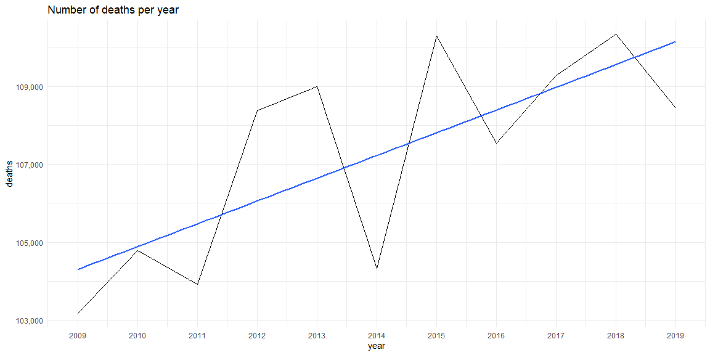<!-- -->

Our model of yearly mortality is built in three steps:

1.  The first input is the structure of the population the
    1st of January of each year between 2009 and 2020
    (i.e. the number of residents of a given age and sex alive on that
    day).

2.  The second input is the mortality data for Belgium for the
    corresponding age, sex and year, i.e. the probability that a person
    who was alive on January 1st morning would be dead on
    December 31st evening. The expected number of deaths for
    a given group and year is simply the product of the first input with
    the second input.

3.  We split the yearly data into weeks based on weekly historic death
    data.

### 1\. Structure of the population

The first input of our model is the structure of the population
published by Statbel (see data sources). The data set gives us the
number of inhabitants of each sex who are alive and have a specific age
on January 1st of a given year. This data is available since
2009.

As you can see on the next graph, the number of people aged 65 years or
more is increasing every year by approximately 34,000, a 1.6% growth.

<!-- -->

### 2\. Death rate

The *death rate* for a given period is the probability that someone of a
given group (i.e. given age group and sex) who is alive at the beginning
of the period would be alive at the end of the period. Unless stated
otherwise, the period is a calendar year.

Let’s look at the death rate for a few ages. As you can see, the death
rate is continuously decreasing except for the age group over 100. This
graph also shows a greater variance of the death rate for older age
groups, which seems to mean that these age groups are more sensitive to
events that happen less than once a year, such as epidemics or
exceptional weather.

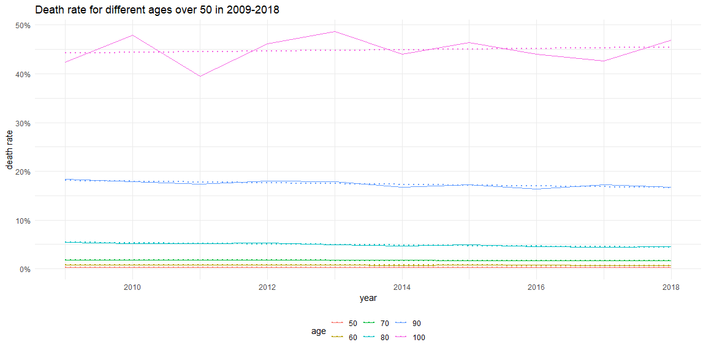<!-- -->

We model the death rate with a linear regression for each age and sex.
This model allows us to extrapolate the data to 2019 and 2020, but it
also removes the year-to-year variations for all previous years. That
is, this death rate model removes the effect of epidemics and weather
conditions that happen less frequently than yearly.

Once we have a death rate model for each group and year, we multiply
this coefficient by the actual population for this group and year, which
should give us the number of expected deaths. However, the expected and
observed number of deaths, summed from 2009 to 2019, don’t match
exactly. This discrepancy is expected and its cause is not important. To
cancel the discrepancy, we apply the following correction factors:

| Age group |         F |         M |
| :-------- | --------: | --------: |
| 0-24      | 1.0014182 | 0.9952485 |
| 25-44     | 0.9919067 | 1.0024983 |
| 45-64     | 0.9997398 | 1.0004118 |
| 65-74     | 1.0073558 | 1.0064647 |
| 75-84     | 0.9930490 | 1.0000072 |
| 85+       | 1.0197549 | 1.0274520 |

Correction factors

The following graphs shows the resulting projections of number of deaths
per year and age group.

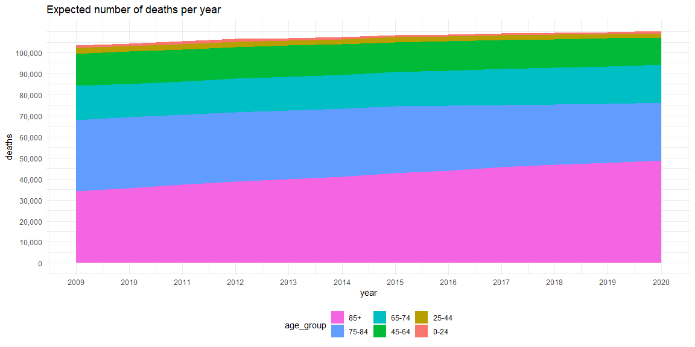<!-- -->

Let’s now compare the projections with the reality:

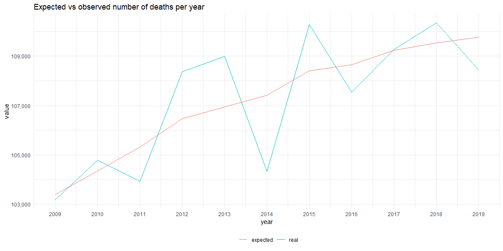<!-- -->

### Splitting years into weeks

We now have a yearly model, but we need weekly projections. For our
weekly model, we first compute the percent of deaths, for each age
group, that happens in a given week of the year, and we multiply this
coefficient with the yearly death rate for this year. Note that we
didn’t compute a different coefficient for each sex because the data
is already noisy enough, especially for younger age groups.

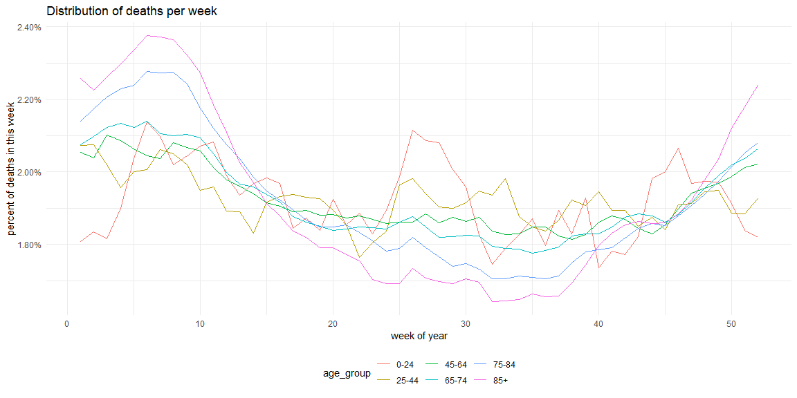<!-- -->

We can notice a higher seasonality of death rate for the more aged
groups. For the younger groups, there is almost no seasonal correlation
but there is however more noise due to the lower amount of data points.
We chose not to address this problem as it should have only minor impact
on the conclusions.

With this weekly model, we can finally compute the weekly predictive
model and compare it with the reality:

<!-- -->

## Excess death rate

*Excess deaths* is the different between the actual number and the
expected number of deaths. When there are fewer deaths than expected,
this is called *death deficit*.

The following graphs represents excess deaths from 2009:

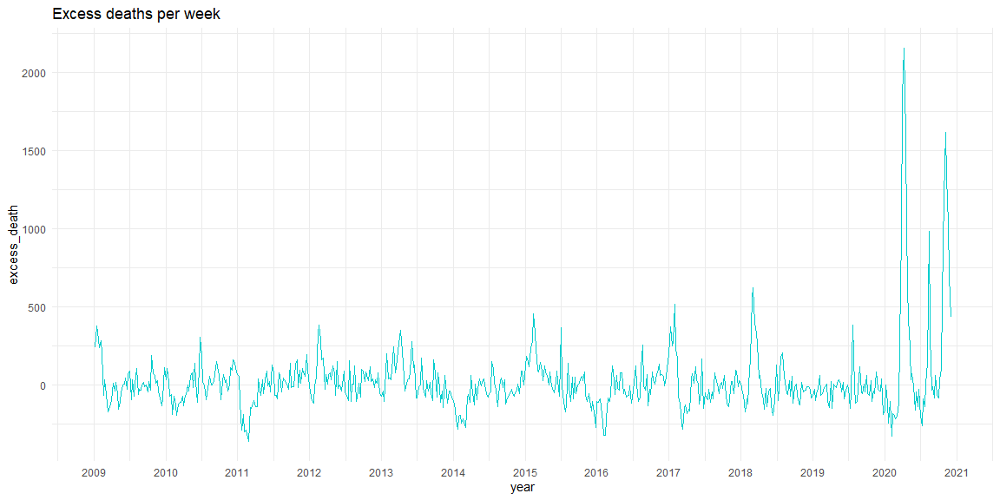<!-- -->

## Cumulative excess mortality

Weekly excess mortality does not give a good insight of the impact of a
specific *event*, such as an epidemic or a special weather condition,
over a long period of time. It does not answer the following questions:

  - How many people died during a specific event?
  - How long does it take to “recover” from the event?

To answer these questions, the cumulative excess mortality (i.e. the
integral of the curve over time) is a better metric.

The following graphs show the cumulative death, first starting from
January 1st, 2009, and then zooming in on 2019-2020.

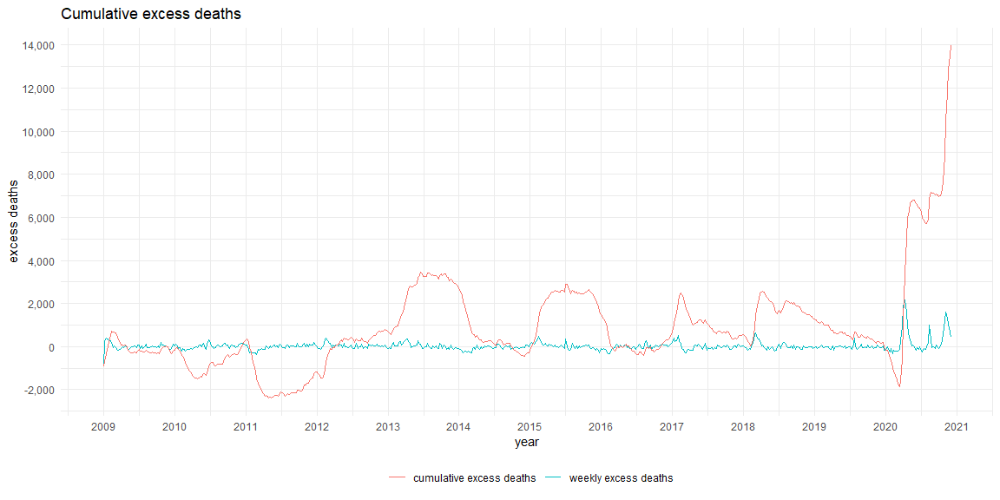<!-- --><!-- -->

Note that the initial value of the cumulative metric is arbitrary. Here,
we chose that the zero point would be January 1st, 2009.
Because our model is based on a linear regression over years, and
because of the yearly fluctuations, we can expect that the zero point is
crossed every second year.

The second arbitrary zero is the one of January 1st, 2020.
This one is the consequence of the calibration of our model with real
data for the period from 2009 to 2019. It is important to understand how
arbitrary this zero is.

The cumulative maximal death deficit was observed on March 11th, 2020,
with a value of 1868 (point represented in green in the graph above). So
when comparing the expected cumulative mortality with the real
cumulative mortality, a difference of 1868 can be obtained just by
choosing a different beginning of the comparison time window.

### Excess death rate by age group

Taking this remark into account, we can now look at the increased death
rate for the year 2020 (between weeks 1 and 49) for different age
groups. The following table shows the difference in death rate during
the studied period in absolute terms and in terms that are relative to
the expected values for 2020.

| Age group | Sex | Expected death rate | Actual death rate | Absolute excess death rate | Relative excess death rate |
| :-------- | :-- | :------------------ | :---------------- | :------------------------- | :------------------------- |
| 0-24      | F   | 0.02%               | 0.01%             | \-0.007%                   | \-35%                      |
| 0-24      | M   | 0.03%               | 0.02%             | \-0.011%                   | \-35%                      |
| 25-44     | F   | 0.05%               | 0.05%             | 0.002%                     | 4%                         |
| 25-44     | M   | 0.09%               | 0.09%             | 0.005%                     | 5%                         |
| 45-64     | F   | 0.31%               | 0.31%             | 0.003%                     | 1%                         |
| 45-64     | M   | 0.48%               | 0.53%             | 0.043%                     | 9%                         |
| 65-74     | F   | 1.06%               | 1.17%             | 0.109%                     | 10%                        |
| 65-74     | M   | 1.84%               | 2.07%             | 0.231%                     | 13%                        |
| 75-84     | F   | 2.99%               | 3.63%             | 0.634%                     | 21%                        |
| 75-84     | M   | 4.63%               | 5.54%             | 0.909%                     | 20%                        |
| 85+       | F   | 12.88%              | 14.60%            | 1.712%                     | 13%                        |
| 85+       | M   | 15.05%              | 17.22%            | 2.169%                     | 14%                        |

Death rates by age group during week 1-49 of 2020

The following graph shows the relative values only:

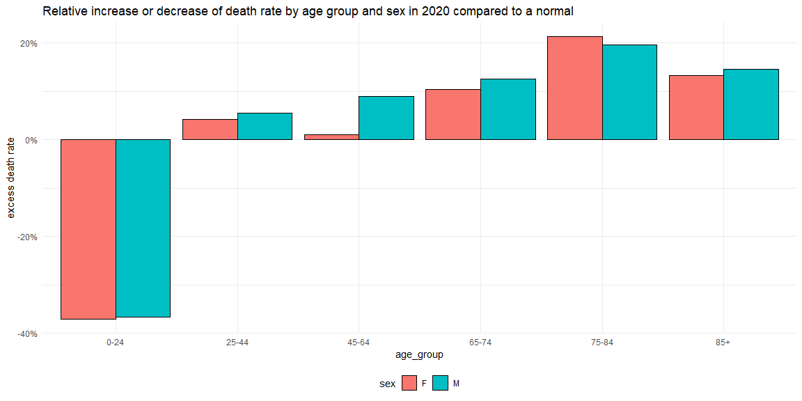<!-- -->

As you can see, the age group whose death rate is the most different in
2020 than the expectation is the younger one, which had 35% less risk to
die in 2020 than in another year. We will come back to this number.

The age group whose death rate is the most negatively affected in 2020
is the 75-84 one, with a risk of dying 20% higher than expected.

### Absolute death rate in historical context

To give some context, here is the historic death rate since 2008
compared to what was *expected* for 2020. The dashed horizontal lines
show the *actual* death rate in 2020. It can be seen on this graph that
the death rates observed in 2020 would be typical for year 2012.

<!-- -->

For more perspective, here the same graph starting from 1900 on a
logarithmic vertical scale.

    ## Warning: Removed 1 rows containing missing values (geom_point).

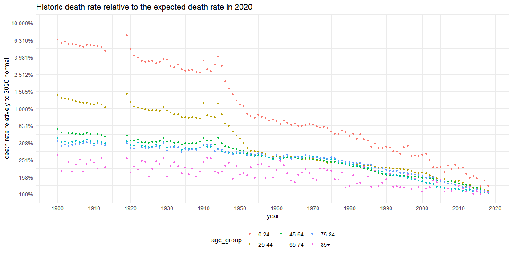<!-- -->

### Death rate variation in historical context

We have seen that the death rate in 2020 was typical for 2012. How can
we then explain the framing of the epidemic, by the government and
media, as a catastrophe of unseen since Word War II or even the Spanish
flu? Looking at the *year-to-year variation* of death rate instead of
the death rate itself gives some hints.

How far should we look in the past to see a death rate that is, in
absolute terms, 1% to 2% higher than normal?

To answer this question, we will use the death rate data of the Human
Mortality Database since 1900. We will define “normal” as being a 5-year
rolling median. The median does a better job than the mean to eliminate
exceptional events like epidemics.

The following graph shows only strictly positive deviations and the
vertical axis is logarithmic, with horizontal lines for 0.2%, 1% and 2%,
the approximate values of excess death rate for the three oldest age
groups.

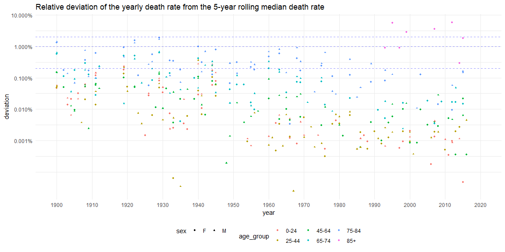<!-- -->

The next graph aggregates the data by decade and shows the maximum
deviation of the yearly death rate from the median death rate during the
whole decade, again with horizontal lines for 0.2%, 1% and 2%.

<!-- -->

It is clear from these 2 graphs that a 2% deviation is usual and even on
the small end for the age group over 85 years.

However, for the groups 65-74 and 75-84, we have to go back to the 1960s
to see a similar deviation.

### Compared death rate: conclusion

How exceptional is 2020 to other years? The conclusion is paradoxical.

If we look at the absolute death rates, 2020 is similar to 2012. If we
look at the excess death rate for the 85+ age group, we also find
numbers that would be usual around 2010. We could then say that 2020 is
a one-in-ten-years occurrence, which would make it difficult to justify
the extraordinary restrictions on freedom of movement and gathering.

However, the real originality of 2020 from the point of view of historic
death data is not the absolute death rate, not even the excess death
rate for the oldest age group, but the *excess death rate of the 64-85
age group*, for which there is no equivalent since the 1960s.

This paradox brings light to the polarized discussion between those who
believe that the epidemic is a normal event that happens every 10 years
(it is, in terms of absolute death rate) and those who believe there was
no worse event since World War II (this is true but the 1960s were not
far).

## Comparison with reported COVID deaths

The following graph compares the number of weekly excess deaths with the
number of deaths attributed to COVID19, as reported by Sciensano.

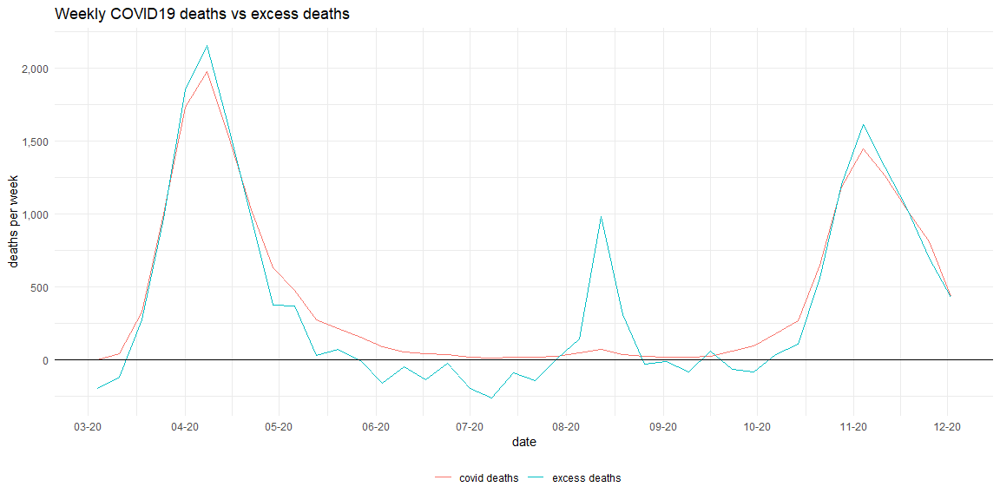<!-- -->

We can see that the number of deaths attributed to COVID19 by Sciensano
copies quite well the number of excess deaths estimated by our model, at
least during the two epidemic peaks. The most notable exception is
during the deaths peak of August. The second difference that needs to be
discussed is the death deficit after the spring peak.

### Death peak in August

The number excess deaths during the heat wave of August 2020 was 1401.
By comparison, the heat wave of July 2019 caused an excess death of 136:
10 times less.

Can this be explained by exceptional temperatures? The following graphs
shows the history of maximum daily temperatures in Belgium as well of a
7-day and a 30-day right-aligned moving average of this metric.

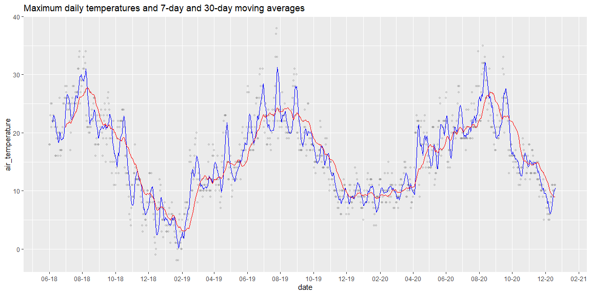<!-- -->

As we can see, the maximal weekly temperatures were not exceptional
compared to 2019 or even 2018. Therefore, temperature alone cannot be a
sufficient explanation of the peek of deaths in August 2020. Other
factors need to be considered, for instance a generally weaker condition
of the population due to the epidemic or to the lockdown itself.

### Death deficit between death peeks

The second difference between the COVID19 death curve and the excess
death curve is that the second shows a death deficit after the first
epidemic peak. This means that a part of people who died during the
epidemic peak would have died anyway a couple of weeks later.

This is more visible on the cumulative excess deaths graph

<!-- -->

During the spring peak, the cumulative excess death was 8676. During the
summer, before the August peak, the death deficit was 1105, that is,
approximately 13% of people who died during of COVID19 during spring had
their life shortened by less than 3 months.

### Comparision of number of deaths by age group

The following chart compares the number of excess deaths in 2020 with
the number of COVID19 deaths.

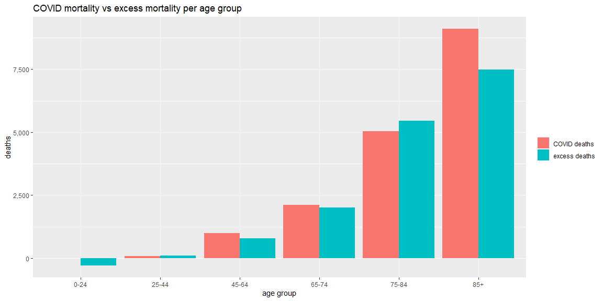<!-- -->

The numbers are quite similar, except for the oldest age group where
COVID19 deaths are 1639 (22%) higher than excess deaths. This means than
an approximate 20% of the people over 85 who died of COVID19 during 2020
(or were diagnosed as such) would have died from another cause in the
same period

## Decreased death rate of the youngest age group

The death rate of the 0-24 age group is 35% lower in 2020 than expected.
How can we explain this significant difference? Intuitively, this could
be explained by the lower exposure to risk of accidents. Let’s test this
hypothesis based on the *Causes of death by month, sex, age group and
region* data set published by Statbel (see data sources).

The cause code V01-Y98 includes all deaths by external causes, including
accidents and homicides. This data is available from 2009 to 2019. Let’s
visualize the percent of accidental deaths by age group and sex:

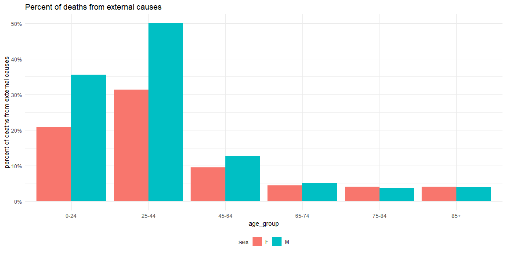<!-- -->

<!-- -->

If we extrapolate this data linearly to 2020, we get a percent of
accidental deaths of 33% for males and 18% for females

This shows that we cannot explain the decrease of the death rate of the
youth in 2020 solely by the decrease of accidental mortality caused by
the lockdowns. For males, it would mean that there would be almost
deaths by accident during the whole period (not just during the
lockdowns). For females, accidental death is smaller than the mortality
drop.

Therefore, other factors have to be considered to explain this drop, and
the data we analyzed does not provide any useful hint.

Because of this, it is also useless to try to interpret the death rate
in 2020 as a negative factor to the the virus itself, and a positive
factor due to the restrictions of movements and activities. Both factors
probably existed, but the data available now do not allow to quantify
them.

## Revisiting controversial questions

This article allows to answer a few polemic questions that rose around
the COVID19 epidemic and the response of the government and mainstream
media:

  - **Is the number of deaths reported by Sciensano exaggerated, either
    by biased diagnostic methods or deliberately? **
    
    **No**, there is no indication that the death data reported by
    Sciensano are incorrect.

  - **Would a majority of people who died from COVID19 have died from
    another cause very soon?**
    
    **No**. Approximately 13% of people who died during of COVID19 would
    have died less than 3 months from other causes. Based on death data,
    we cannot take any conclusion for a longer time period or for the
    people who died in autumn.

  - **Has the restrictions of freedom of movement impacted the death
    rate?**
    
    **Yes**, the death rate on the 0-24 age group has decreased by 35%
    relatively to normal in 2020. However this decrease cannot be
    explained by a decrease of accidental mortality alone.

  - **How exceptional was year 2020 in terms of mortality?**
    
    By definition, an *exception* is an event that does not occur
    frequently. Therefore, to assess the exceptionally of an event, we
    to find a comparable precedent.
    
    Whether we look at the *absolute* or *excess* death rate, we get a
    different level of exceptionally.
    
    **Once in 50 years** if you look at excess death rate for the age
    group from 65 to 74 years, i.e. the risk of dying in 2020 compared
    to expectations. There is no equivalent of the excess death rate
    since the 1960s.
    
    **Once in 10 years** if you look at absolute death rate number. The
    absolute death rates of 2020 are close to the ones of 2010. That is,
    if there were in 2010 the same number of deaths than in 2020 for the
    same population structure, this would be a normal year.
    
    2020 is *at most* 20% worse than a normal year. For people in the
    most affected age group, the risk to dying of coronavirus in 2020
    (*additionally* to normal risks), was 20% than the risk of dying
    from another reason.

This article also lets a few questions unanswered:

  - **How to explain the 35% decrease of mortality in the 0-24 age
    group?**
    
    A decrease of accidental mortality is not a sufficient explanation.
    This mortality deficit should be modeled and applied to the 25-45
    age group, which is typically also subject to higher accidental
    death. This would result in a higher death rate attributed to
    COVID19 in this age group. The data analyzed here did not allow us
    to perform sich analysis.

  - **How to explain the increased mortality during August 2020?**
    
    The mortality was 10 times higher during the heat peak of July 2020
    than during the one of July 2019. Temperatures were not
    significantly higher, therefore another explanation is necessary.

Probably the most important question that article *cannot* answer is:
**What would have been the mortality *without* the lockdowns?**
Analyzing past mortality data in only one country certainly cannot
answer this question. Lockdowns do not heal, but they help decreasing
the mortality in two ways: first by avoiding the overload of the health
system, secondly because the knowledge of the virus and its cures
increase overtime

## Conclusion

This article challenges the believe that the 85+ age group is the most
affected by the COVID19 epidemic. In terms of absolute mortality, this
is true that this group is the most affected. However, the mortality in
this age group seems to be caused, much more than for any age group, by
events that have a frequency of approximately one every second year, as
opposed to events that occur yearly. If you look at the *relative*
increase of the death rate, the 85+ age group is twice less affected
than the 75-74 one.

Perhaps the most striking conclusion is the paradox between the fact
that, on one side, the death rate in 2020 was equivalent to the one
around 2010 and, on the other side, there has not been a comparable
year-to-year variation of death rate for the 65-84 age group until the
1960s.

What happened that a death rate by age group that would have been normal
in 2010 now cause major disruptions of our societies?

An element of answer is that disruptions were imposed to prevent higher
mortality, i.e. based on *expectations* of mortality and not based on
historical data. It would be more fair to judge the efficiency of
political action by the *avoided* mortality rather than by the actual
mortality, which means that we would need to compare actual mortality
with expected mortality for the COVID-19 epidemic in Belgium. It will
not be possible to evaluate the impact of the lockdowns until the
epidemic is completely finished. Until such analysis is possible, we can
only reason based on actual mortality.

Historic data clearly shows both the death rate and the year-to-year
deviation from the expected death rate  
have constantly decreased since the 1950s. This constant reduction of
risk may have major sociological, psychological and political
implications. Rulers and politicians alike have instrumentalized fear
for centuries to control populations, and instrumentalized victims to
justify their oppressive policies and consolidation of power. With an
increasingly lower tolerance to the risk of dying, the political
opportunity to instrument epidemics is also growing. This effect is
amplified by the simple fact that the number of older voters is growing
and politicians have a record of implementing short-sighted strategies
just to win more votes.

We have seen that 2020 can be compared to 2010 in terms of absolute
mortality. We should also compare 2020 to past years using other
criteria: quality of life, actuation of civic rights, possibility to die
in dignity, social justice, respect of the State of Law, freedom of
speech, … When last did we see similar regressions in Belgium? We would
probably need to look back to 1940-1945.

Are we willing to live in wartime conditions to maintain a mortality
under what would be acceptable just one or two decades ago? What it the
acceptable risk? When should we stop accepting restrictions to live in
the name of reducing risk?

Once the COVID-19 epidemic will belong to the past, once will be able to
estimate the real costs and benefits of the lockdowns, these questions
will become unavoidable.

It has been repeated *ad nauseam* that the economics must not prevail
over human life. This oversimplified moral imperative has been used to
justify the sacrifice of small businesses, students and other segments
of the population, or the air transportation industry. It must be
questioned. At least, the media should return it to a few mega companies
in industries like food, oil, tobacco or pharmacy – to see if really
still applies to everybody.

The real question of 2020 is rather: should mere biological survival
prevail over the possibility a fully human life, a human life with
friends, family, sports, politics, arts, religion, … all the facets that
make life really human.
